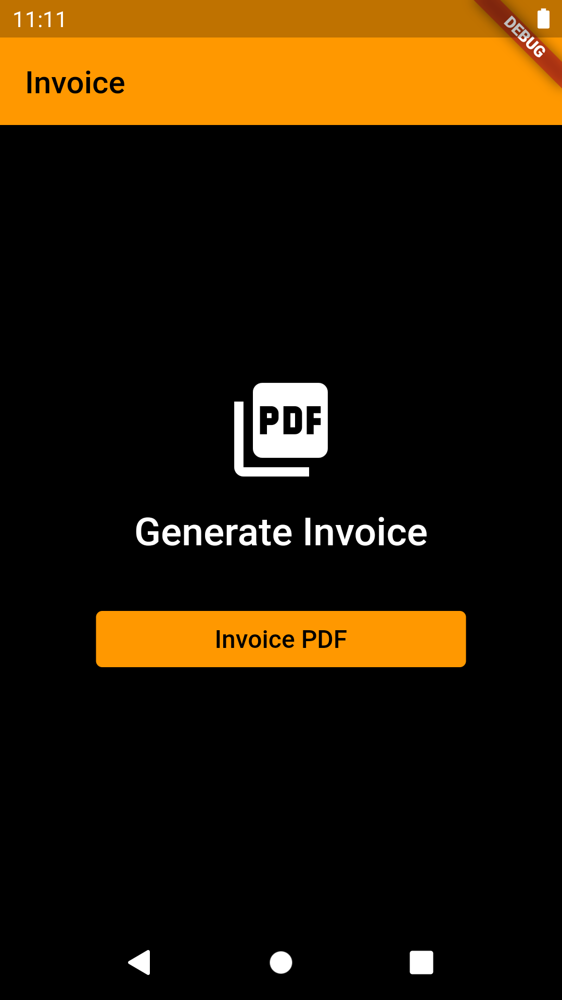
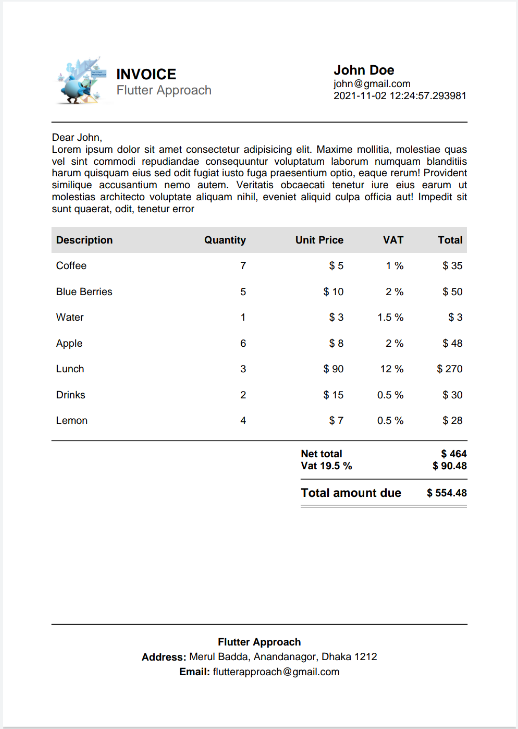

# Flutter Generate PDF

Welcome to **Flutter Generate PDF** – your go-to Flutter application for creating compelling sales pitches in PDF format. Whether you're a sales professional or a business owner, our app simplifies the process of crafting and presenting persuasive sales materials.

## screenshots
| Home Page | pdf generate | 
| ----------- | ----------- |
|||
## Features

- **Effortless Sales Pitch Creation:** Design captivating sales pitches with an intuitive and user-friendly interface.
- **PDF Generation:** Seamlessly convert your sales pitch into a professional-looking PDF document.
- **Customization Options:** Tailor your pitches with customizable templates, fonts, and layouts.
- **Instant Sharing:** Quickly share your PDF pitches with clients, colleagues, or prospects.

## Prerequisites

Before you begin, make sure you have the following installed:

- **Flutter SDK:** Follow the [official Flutter installation guide](https://flutter.dev/docs/get-started/install).
- **PDF Library:** Add the PDF library to your `pubspec.yaml` file:

```yaml
dependencies:
  pdf: ^3.6.0
```
## Packages Used

| Package        | Description                                           |
|----------------|-------------------------------------------------------|
| Flutter        | Framework for building natively compiled applications for mobile, web, and desktop. |
| PDF            | Library for creating and processing PDF documents.    |

## Contribution

Contributions to the project are welcome! If you'd like to contribute, please fork the repository and make changes as you'd like. Pull requests are warmly welcome.

## License

Maktabty is released under the MIT License. See the [LICENSE](LICENSE) file for more details.

####  Follow me :

<div id="badges">
  <a href="https://www.linkedin.com/in/abdulrahman-hatem-64780a210">
    
  </a>
  <a href="https://twitter.com/Abdelra87827997">
    
  </a>
   <a href="https://www.youtube.com/@AlHatemSoftware">
    
  </a>
</div>